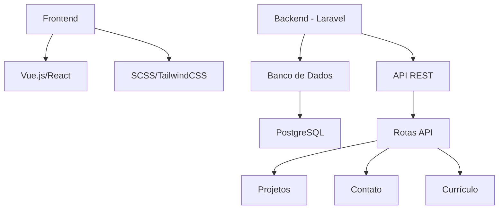
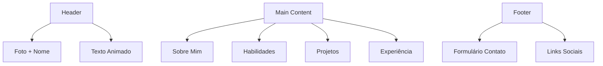
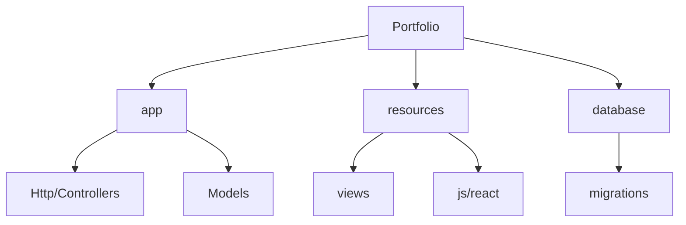

# Plano Detalhado para Portfólio

## 1. Arquitetura Técnica

### Stack Tecnológica
- **Backend:**
  - Laravel 10.x
  - PHP 8.x
  - PostgreSQL
  - API RESTful

- **Frontend:**
  - React (integrado com Laravel)
  - TailwindCSS para estilização
  - Framer Motion para animações
  - TypeScript para tipo seguro

## 2. Design e Layout

### Seções Principais
1. **Header**
   - Foto profissional em terno
   - Nome "Paulo Souza Marques"
   - Subtítulo animado "Desenvolvedor Web"
   
2. **Habilidades**
   - Cards interativos mostrando:
     - JavaScript/React/Node
     - PHP/Laravel
     - MongoDB/PostgreSQL
   
3. **Experiência Profissional**
   - Destaque para experiência na Diretoria de Obras de Cooperação
   - Sistema de Obras
   - Sistema de Intranet/Internet

4. **Projetos**
   - E-commerce (React/Node)
   - Sistema de Gerenciamento (PHP/Laravel)
   - Outros projetos relevantes

5. **Contato**
   - Formulário de contato
   - Currículo para download
   - Links profissionais

## 3. Funcionalidades

### Animações e Interatividade
- Texto animado no header usando biblioteca de animação
- Cards de habilidades com efeitos hover
- Transições suaves entre seções
- Lazy loading para imagens e conteúdo

### Sistema de Administração
- Painel admin para atualizar:
  - Projetos
  - Habilidades
  - Informações de contato
  - Currículo

### Formulário de Contato
- Validação em tempo real
- Proteção contra spam
- Notificações por email
- Sistema de captcha

## 4. Estrutura de Diretórios

## 5. Etapas de Implementação

1. **Fase 1: Setup Inicial**
   - Configuração do Laravel
   - Integração com React
   - Setup do banco de dados

2. **Fase 2: Backend**
   - Desenvolvimento das APIs
   - Sistema de administração
   - Integrações

3. **Fase 3: Frontend**
   - Implementação do layout
   - Componentes React
   - Animações

4. **Fase 4: Conteúdo e Otimização**
   - SEO
   - Performance
   - Testes
   - Deploy